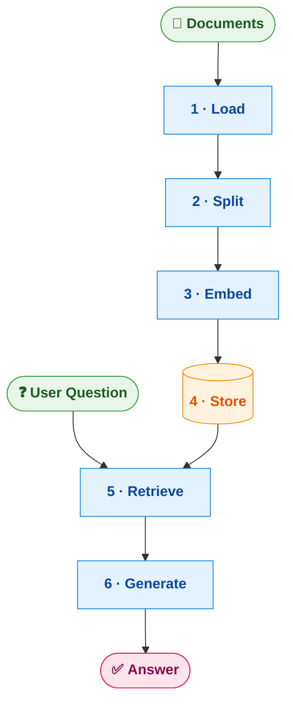

# Python RAG

A simple Retrieval-Augmented Generation (RAG) system that answers questions from your PDF documents using ChromaDB, LangChain, and OpenAI — with a Gradio chat UI.

## How it works



## Prerequisites

- Python 3.14+
- [uv](https://docs.astral.sh/uv/getting-started/installation/) package manager
- OpenAI API key

## Setup

**1. Clone the repo**

```bash
git clone https://github.com/ahsan85/rag-example.git
cd python-rag
```

**2. Install dependencies**

```bash
uv sync
```

**3. Configure your API key**

```bash
cp .env.example .env
```

Open `.env` and replace the placeholder:

```
OPENAI_API_KEY=sk-...
```

**4. Add your PDF files**

Place your PDF documents in the `data/pdf/` folder:

```
data/
└── pdf/
    ├── your-document.pdf
    └── another-file.pdf
```

**5. Index the documents**

```bash
uv run python reindex.py
```

This reads all PDFs from `data/pdf/`, embeds them, and saves the vector index to `data/chroma/`. Re-run this whenever you add or change PDFs.

**6. Launch the chat UI**

```bash
uv run python main.py
```

Opens at `http://127.0.0.1:7860`

## Project structure

```
├── main.py          
├── reindex.py      
├── data/
│   └── pdf/          # ← Place your PDF files here
├── src/rag/
│   ├── loader.py    
│   ├── embedder.py   
│   ├── store.py      
│   ├── pipeline.py   
│   └── ui.py        
└── .env.example      
```

## Tech stack

| Tool | Purpose |
|------|---------|
| [ChromaDB](https://www.trychroma.com/) | Local vector database |
| [LangChain](https://www.langchain.com/) | Document splitting & LLM abstractions |
| [OpenAI](https://platform.openai.com/) | Embeddings + chat completions |
| [pdfplumber](https://github.com/jsvine/pdfplumber) | Table-aware PDF extraction |
| [Gradio](https://www.gradio.app/) | Chat UI |
| [uv](https://docs.astral.sh/uv/) | Python package management |

## License

MIT
